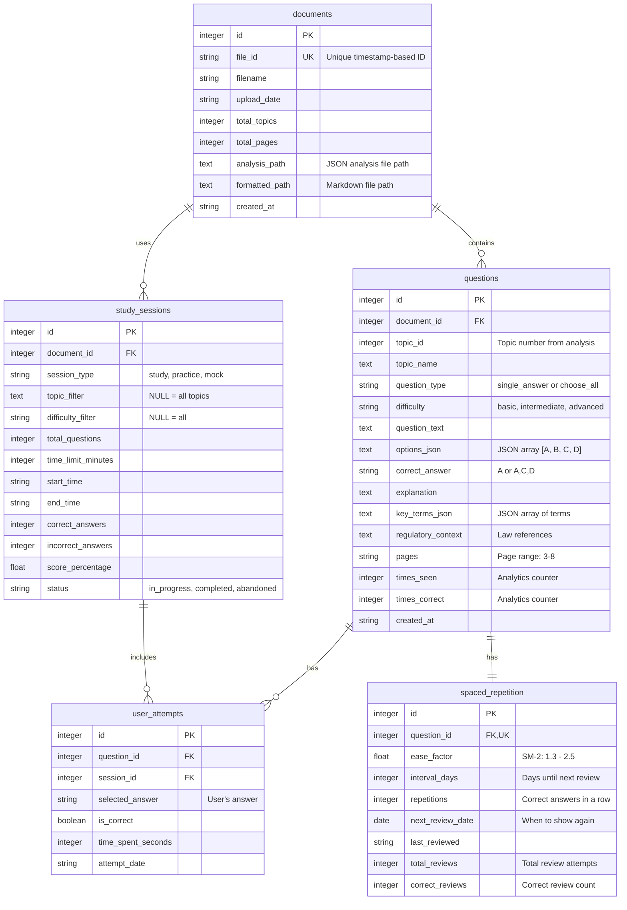

# Database Entity Relationship Diagram

This diagram shows the database schema for the Pharmacy Exam Prep application.

## Entity Relationship Diagram



## Relationship Details

### documents → questions (One-to-Many)
- Each document can have multiple questions generated from its topics
- When a document is deleted, all its questions are deleted (CASCADE)
- Questions link back to their source document for context

### documents → study_sessions (One-to-Many)
- Each document can be used in multiple study sessions
- When a document is deleted, all related sessions are deleted (CASCADE)
- Sessions track which document was being studied

### questions → user_attempts (One-to-Many)
- Each question can be attempted multiple times
- When a question is deleted, all attempts are deleted (CASCADE)
- Tracks user answers for analytics and progress

### study_sessions → user_attempts (One-to-Many)
- Each session contains multiple question attempts
- When a session is deleted, attempts are preserved (SET NULL)
- Links attempts to their session context

### questions → spaced_repetition (One-to-One)
- Each question has exactly one spaced repetition entry
- When a question is deleted, its SR data is deleted (CASCADE)
- Tracks optimal review timing using SM-2 algorithm

## Key Design Decisions

### 1. Cascade Deletes
- **documents CASCADE**: Removing a document should remove all derived data
- **questions CASCADE**: Removing a question removes its attempts and SR data
- **study_sessions SET NULL**: Preserve attempt history even if session is deleted

### 2. Indexes
- **file_id**: Fast document lookup by timestamp ID
- **document_id**: Fast question/session retrieval for a document
- **topic_id**: Filter questions by topic
- **question_type, difficulty**: Quick filtering for exam generation
- **is_correct, attempt_date**: Analytics queries
- **session_type, status, start_time**: Session management
- **next_review_date**: Daily review queue queries

### 3. Date/Time Storage
- All dates stored as ISO 8601 strings for simplicity
- SQLite Date type only for `next_review_date` (used in comparisons)
- Timezone-aware through ISO format

### 4. JSON Storage
- `options_json`: Question choices as JSON array
- `key_terms_json`: Terms with definitions
- Keeps schema flexible without additional tables
- Easy to parse in Python/JavaScript

## Sample Queries

### Get questions due for review today
```sql
SELECT q.*
FROM questions q
JOIN spaced_repetition sr ON q.id = sr.question_id
WHERE sr.next_review_date <= DATE('now')
ORDER BY sr.next_review_date;
```

### Get user accuracy by topic
```sql
SELECT q.topic_name,
       SUM(CASE WHEN ua.is_correct THEN 1 ELSE 0 END) * 100.0 / COUNT(*) as accuracy
FROM user_attempts ua
JOIN questions q ON ua.question_id = q.id
GROUP BY q.topic_name;
```

### Get recent study sessions with scores
```sql
SELECT ss.*, d.filename
FROM study_sessions ss
JOIN documents d ON ss.document_id = d.id
WHERE ss.status = 'completed'
ORDER BY ss.start_time DESC
LIMIT 10;
```

## Database Size Estimates

Based on a typical 100-page PDF generating 300 questions:

| Table | Rows | Size per Row | Total |
|-------|------|--------------|-------|
| documents | 1 | ~500 bytes | 500 bytes |
| questions | 300 | ~1.5 KB | 450 KB |
| user_attempts | ~3000 | ~100 bytes | 300 KB |
| study_sessions | ~30 | ~200 bytes | 6 KB |
| spaced_repetition | 300 | ~100 bytes | 30 KB |

**Total estimated size**: ~800 KB per document with active usage

For 10 documents: ~8 MB database size
