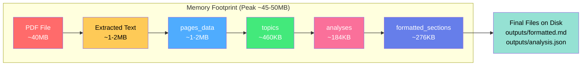
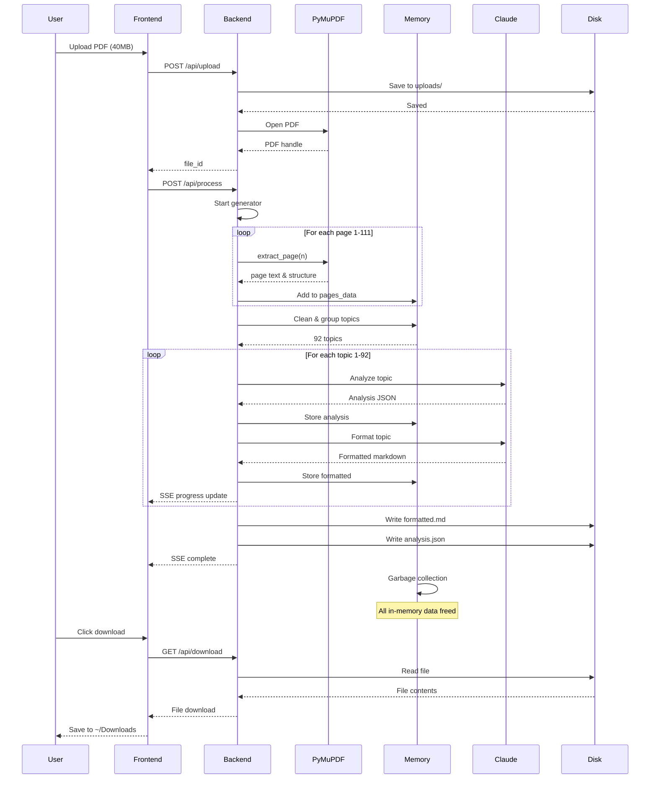
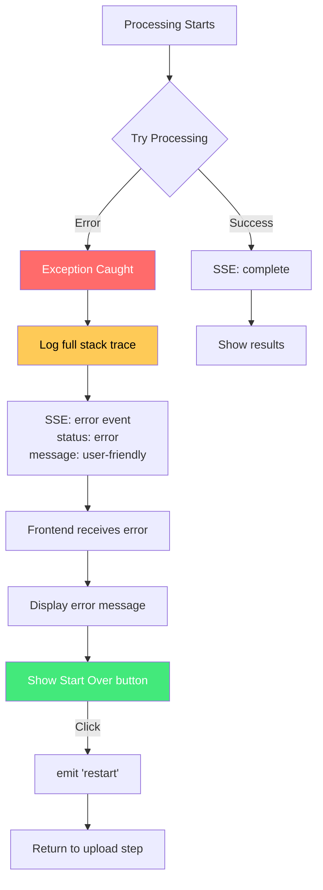
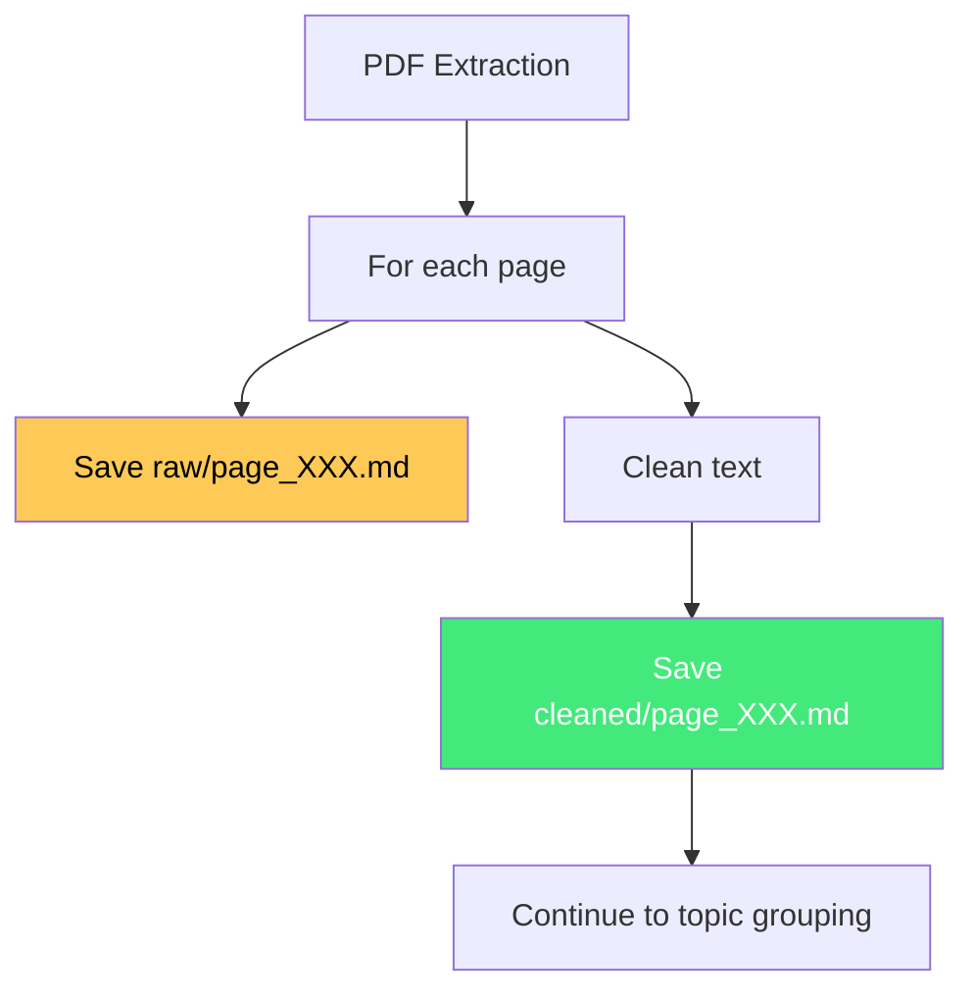

# Application Flow Diagram

## Complete End-to-End Processing Flow

```mermaid
flowchart TB
    Start([User Opens Browser]) --> Frontend[Frontend Loads<br/>http://localhost:5001]
    Frontend --> Upload[FileUpload Component<br/>Step: upload]

    Upload -->|User selects PDF| FileSelect[File Selected Event]
    FileSelect -->|Console: File selected| Upload2[Upload Button Clicked]
    Upload2 -->|POST /api/upload| Backend1[Backend: upload_file]

    Backend1 -->|Log: Upload request received| SaveFile[Save to uploads/<br/>timestamp_filename.pdf]
    SaveFile -->|Log: File saved| ExtractMeta[PyMuPDF: Get page count]
    ExtractMeta -->|Log: PDF has N pages| ReturnID[Return file_id to frontend]

    ReturnID -->|Response: file_id, filename, size, pages| Frontend2[Frontend receives file_id]
    Frontend2 -->|Console: File uploaded with ID| SwitchStep[App switches to process step]

    SwitchStep --> ProcessComp[ProcessingStatus Component<br/>Step: process]
    ProcessComp -->|Mount & POST /api/process/file_id| Backend2[Backend: process_file]

    Backend2 -->|Log: Processing request| Generator[Start Generator Function]
    Generator -->|Yield SSE event| SSE1[SSE: progress 10%<br/>message: Starting extraction]

    SSE1 --> Extract[PDF Extraction Phase]
    Extract -->|Log: Extracting N pages| Loop1[Loop: For each page 1-111]

    Loop1 -->|PyMuPDF| ExtractPage[PDFExtractor.extract_page]
    ExtractPage -->|Get text blocks & fonts| DetectHeaders[Detect headers by font size]
    DetectHeaders -->|Structure: title, headers, text_blocks| PageData[pages_data list in memory<br/>~1-2MB for 111 pages]

    PageData -->|All pages extracted| SSE2[SSE: progress 30%<br/>message: Extraction complete]
    SSE2 --> Process[Text Processing Phase]

    Process -->|Log: Processing text| Clean[TextProcessor.clean_text]
    Clean -->|Remove repeated headers/footers| LLMIdentify[LLM Topic Identification<br/>NEW: Semantic analysis]

    LLMIdentify --> Chunk1[Chunk 1: Pages 1-10]
    Chunk1 -->|Claude API| IdentifyTopics1[Identify topics semantically]
    IdentifyTopics1 --> Summary1[Generate summary of last 2-3 pages]

    Summary1 --> Chunk2[Chunk 2: Pages 11-20]
    Chunk2 -->|Context: topics + summary| IdentifyTopics2[Identify topics with context]
    IdentifyTopics2 --> Summary2[Generate new summary]

    Summary2 --> MoreChunks{More chunks?}
    MoreChunks -->|Yes| NextChunk[Continue with context...]
    MoreChunks -->|No| Topics[topics list in memory<br/>41 topics × ~5KB = 205KB]

    Topics -->|Log: Identified 41 topics| SSE3[SSE: progress 50%<br/>message: Processing topics]
    SSE3 --> Analyze[Analysis Phase]

    Analyze -->|Loop: For each topic 1-41| Topic1[Topic 1/41]
    Topic1 -->|Log: Processing topic X/41| Claude1[ContentAnalyzer.analyze_topic]

    Claude1 -->|Anthropic API Call| ClaudeAPI1[Claude API: Analysis<br/>Model: claude-3-5-sonnet-20241022]
    ClaudeAPI1 -->|Log: Analyzing topic| Request1[POST https://api.anthropic.com/v1/messages<br/>Max tokens: 2000<br/>Temperature: 0.1]

    Request1 -->|~3-6 seconds| Response1[Response: JSON metadata<br/>main_topic, subtopics, key_terms, etc.]
    Response1 -->|Log: Analysis complete| Analysis[analyses list in memory<br/>92 × 2KB = 184KB]

    Analysis --> Format1[LLMFormatter.format_topic]
    Format1 -->|Log: Formatting topic| ClaudeAPI2[Claude API: Formatting<br/>Model: claude-3-5-sonnet-20241022]

    ClaudeAPI2 -->|POST /v1/messages<br/>Max tokens: 3000<br/>Temperature: 0.3| Response2[Response: Markdown with YAML<br/>frontmatter, emojis, structure]
    Response2 -->|Log: Formatting complete| Formatted[formatted_sections list<br/>92 × 3KB = 276KB]

    Formatted -->|Progress calculation| SSE4[SSE: progress 50 + topic/92*50%<br/>message: Processing topic X/92]
    SSE4 -->|Loop continues| Topic2{More topics?}

    Topic2 -->|Yes| Topic1
    Topic2 -->|No, all 92 done| Combine[Combine Phase]

    Combine -->|Log: Processing complete| WriteFiles[Write Output Files]
    WriteFiles --> WriteFormatted[Write outputs/file_id_formatted.md<br/>All 92 sections concatenated]
    WriteFormatted --> WriteJSON[Write outputs/file_id_analysis.json<br/>All analyses as JSON array]

    WriteJSON -->|Log: Files saved| SSE5[SSE: progress 100%<br/>status: complete]
    SSE5 -->|Frontend receives| Complete[ProcessingStatus: complete event]

    Complete -->|emit 'complete'| Result[App switches to result step]
    Result --> ResultComp[ResultViewer Component<br/>Step: result]

    ResultComp --> Download1[Download Formatted Button]
    ResultComp --> Download2[Download Analysis Button]

    Download1 -->|GET /api/download/file_id/formatted| Backend3[Backend: Serve formatted.md]
    Download2 -->|GET /api/download/file_id/analysis| Backend4[Backend: Serve analysis.json]

    Backend3 --> End1([User Downloads Formatted MD])
    Backend4 --> End2([User Downloads Analysis JSON])

    style Frontend fill:#667eea,color:#fff
    style Backend1 fill:#f093fb,color:#fff
    style Backend2 fill:#f093fb,color:#fff
    style Extract fill:#4facfe,color:#fff
    style Process fill:#4facfe,color:#fff
    style Analyze fill:#43e97b,color:#fff
    style Combine fill:#fa709a,color:#fff
    style ClaudeAPI1 fill:#feca57,color:#000
    style ClaudeAPI2 fill:#feca57,color:#000
    style PageData fill:#ff6b6b,color:#fff
    style Topics fill:#ff6b6b,color:#fff
    style Analysis fill:#ff6b6b,color:#fff
    style Formatted fill:#ff6b6b,color:#fff
```



## Memory Usage Breakdown



## Data Structures in Memory

```mermaid
classDiagram
    class pages_data {
        List~Dict~
        [
          {
            page_num: 1,
            title: "...",
            headers: [...],
            text_blocks: [...]
          },
          ...111 items
        ]
        Size: ~1-2MB
    }

    class topics {
        List~Dict~
        [
          {
            title: "...",
            headers: [...],
            text: "...",
            pages: [1, 2]
          },
          ...92 items
        ]
        Size: ~460KB
    }

    class analyses {
        List~Dict~
        [
          {
            main_topic: "...",
            subtopics: [...],
            key_terms: [...],
            exam_critical_points: [...]
          },
          ...92 items
        ]
        Size: ~184KB
    }

    class formatted_sections {
        List~String~
        [
          "---\ntopic: ...\n---\n# ...",
          ...92 items
        ]
        Size: ~276KB
    }

    pages_data --> topics : group_by_topic()
    topics --> analyses : analyze_topic()
    analyses --> formatted_sections : format_topic()
    formatted_sections --> "formatted.md" : write to disk
    analyses --> "analysis.json" : write to disk
```

## Sequential Processing Flow (Memory Efficient)



## Error Handling Flow



## File System Layout

```
supertest/
├── uploads/                          # Uploaded PDFs
│   └── 20251016_080459_repaso_ley_2025.pdf  (~40MB)
│
├── outputs/                          # Generated files
│   ├── 20251016_080459_formatted.md  (~500KB)
│   └── 20251016_080459_analysis.json (~100KB)
│
├── logs/                             # Application logs
│   └── backend.log                   (grows over time)
│
├── backend/
│   ├── app.py                        # Main Flask app
│   ├── pdf_extractor.py              # PyMuPDF extraction
│   ├── text_processor.py             # Cleaning & grouping
│   ├── content_analyzer.py           # Claude analysis
│   └── llm_formatter.py              # Claude formatting
│
└── frontend/
    ├── src/
    │   ├── App.vue                   # Main app logic
    │   └── components/
    │       ├── FileUpload.vue        # Upload UI
    │       ├── ProcessingStatus.vue  # Progress UI (SSE)
    │       └── ResultViewer.vue      # Download UI
    └── dist/                         # Built frontend
        └── (copied to backend/static/)
```

## Rate Limits (Anthropic API)

From the logs, your current rate limits are:
- **Input tokens**: 40,000/minute
- **Output tokens**: 8,000/minute
- **Requests**: 50/minute
- **Total tokens**: 48,000/minute

For 92 topics:
- **2 API calls per topic** = 184 total calls
- At 50 requests/minute = **~4 minutes** minimum processing time
- **Actual time**: ~10-15 minutes (due to analysis/formatting complexity)

## Key Insights

1. **Memory is NOT a concern**: Peak usage ~45-50MB for 111-page PDF
2. **Sequential processing**: Only one topic processed at a time
3. **API rate limits**: Main bottleneck, not memory
4. **Logging everywhere**: Console (frontend) + logs/backend.log (backend)
5. **Error recovery**: Start Over button returns to upload without refresh
6. **No permanent page storage**: Pages flow through memory only

---

## Proposed: Option C Implementation (Raw + Cleaned Pages)

If we add Option C, the new flow would be:



**New file structure:**
```
outputs/
└── 20251016_080459/
    ├── pages/
    │   ├── raw/
    │   │   ├── page_001.md
    │   │   ├── page_002.md
    │   │   └── ...111 files
    │   └── cleaned/
    │       ├── page_001.md
    │       ├── page_002.md
    │       └── ...111 files
    ├── formatted.md
    └── analysis.json
```

**Memory impact**: ZERO (write to disk immediately, don't store in memory)
**Disk space**: ~111 × 2KB × 2 = ~444KB additional
**Processing time**: +5-10 seconds for file I/O

Should I proceed with implementing Option C?
